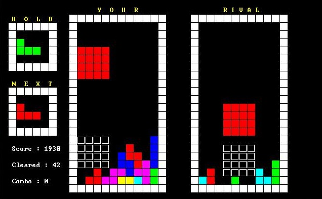
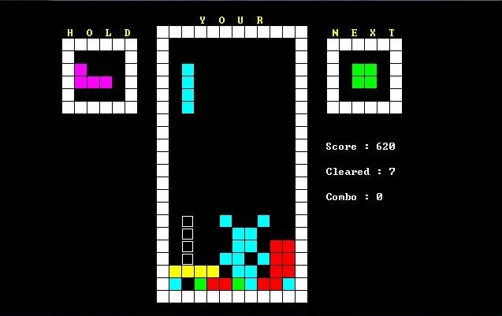
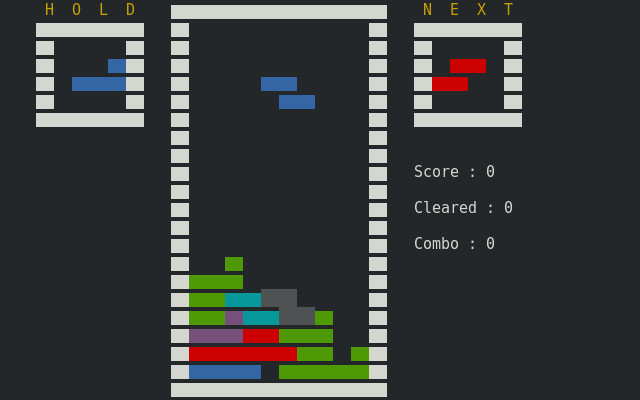

# Tetris_Battle

## 操作說明

      Up   : 旋轉方塊  Left : 往左移動

     Space : 下降方塊  Right: 往右移動

       C   : 保留方塊  Down : 往下移動

       P   : 暫停遊戲
     
     
     
## Preview

### Windows

     
### Linux

